# 负复杂网络节点重要性深度学习模型分析文档

---

[toc]


---

## 项目说明

### 项目概述

本项目实现了一个用于计算负复杂网络中节点重要性的深度学习模型。该模型结合图神经网络和对比学习机制，能够有效地预测动态网络中节点的传播重要性（SIR值）。模型通过学习图结构特征和节点属性，为网络中的每个节点分配一个重要性分数，用于识别关键节点。

### 项目结构

```
DGCN3/
├── main.py                 # 主程序入口，包含训练和推理流程
├── model.py                # 模型定义，包含NodeImportanceModel和MPNN类
├── data.py                 # 数据处理模块，负责加载和预处理图数据
├── eval.py                 # 评估模块，计算模型性能指标
├── SIR.py                  # SIR传播模型实现，用于生成节点重要性标签
├── pre_data.py             # 数据预处理工具，处理原始数据文件
├── config.ini              # 配置文件，存储模型超参数
├── datasets/               # 数据集目录
│   ├── raw_data/           # 原始数据
│   └── processed_data/     # 处理后的数据
└── sir_results/            # SIR模拟结果存储目录
```

### 功能模块

1. **数据处理模块 (data.py)**
   - 从原始边列表文件构建图结构
   - 计算节点特征（度特征、H-index特征、社区特征等）
   - 加载SIR值作为节点重要性标签
   - 构建PyTorch Geometric格式的数据对象

2. **模型模块 (model.py)**
   - MPNN类：基于图注意力网络(GAT)的消息传递神经网络
   - NodeImportanceModel类：结合MPNN和对比学习的节点重要性预测模型

3. **SIR模拟模块 (SIR.py)**
   - 实现SIR传播模型，模拟疾病在网络中的传播过程
   - 计算每个节点的传播影响力，作为节点重要性的标签

4. **评估模块 (eval.py)**
   - 计算Kendall's Tau相关系数，评估排序一致性
   - 计算平均精度(MAP)，评估重要节点识别能力

5. **主程序 (main.py)**
   - 训练流程：加载数据、初始化模型、训练模型、保存模型
   - 推理流程：加载模型、预测节点重要性、评估结果

### 运行方式

1. 数据准备：
   ```bash
   # 生成SIR值
   python main.py  # 运行SIR模拟部分
   ```

2. 模型训练与评估：
   ```bash
   python main.py --dataset_name [dataset_name]
   ```

## 算法说明

### 模型整体结构

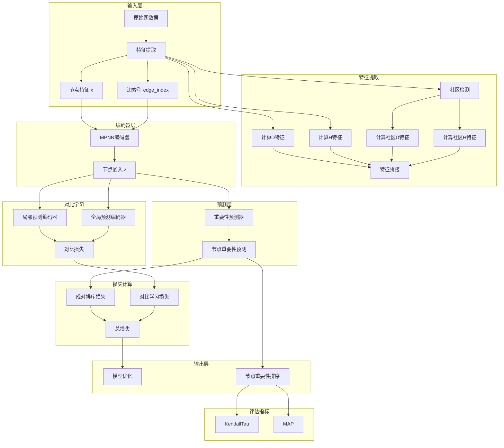

NodeImportanceModel模型由以下主要组件构成：

1. **输入层**：接收原始图数据，包括节点特征和边索引
2. **特征提取**：计算多种结构特征，包括度特征(D)、H-index特征(H)和社区特征
3. **MPNN编码器**：基于图注意力网络(GAT)的消息传递神经网络，用于学习节点的嵌入表示
4. **重要性预测器**：全连接层，将节点嵌入映射为重要性分数
5. **对比学习模块**：包含局部和全局预测编码器，通过对比学习优化节点表示
6. **损失函数**：结合排序损失和对比学习损失的总损失函数
7. **评估指标**：使用KendallTau和MAP评估模型性能

### 各层维度变化分析

以一个具体示例说明模型中数据的维度变化：

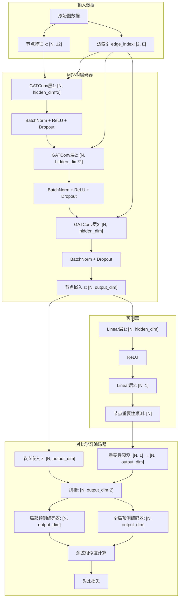

假设一个具有100个节点和500条边的图，具体维度变化如下：

1. **输入数据**：
   - 节点特征 x: [100, 12]，包含度特征、H-index特征和社区特征
   - 边索引 edge_index: [2, 500]，表示图的连接关系

2. **MPNN编码器**：
   - GATConv层1: [100, 12] → [100, 256] (假设hidden_dim=128)
   - BatchNorm + ReLU + Dropout: 维度保持不变 [100, 256]
   - GATConv层2: [100, 256] → [100, 256]
   - BatchNorm + ReLU + Dropout: 维度保持不变 [100, 256]
   - GATConv层3: [100, 256] → [100, 256] (假设output_dim=256)
   - BatchNorm + Dropout: 维度保持不变 [100, 256]
   - 节点嵌入 z: [100, 256]

3. **重要性预测器**：
   - Linear层1: [100, 256] → [100, 256]
   - ReLU: 维度保持不变 [100, 256]
   - Linear层2: [100, 256] → [100, 1]
   - 输出: [100] (每个节点的重要性得分)

### 对比学习处理流程

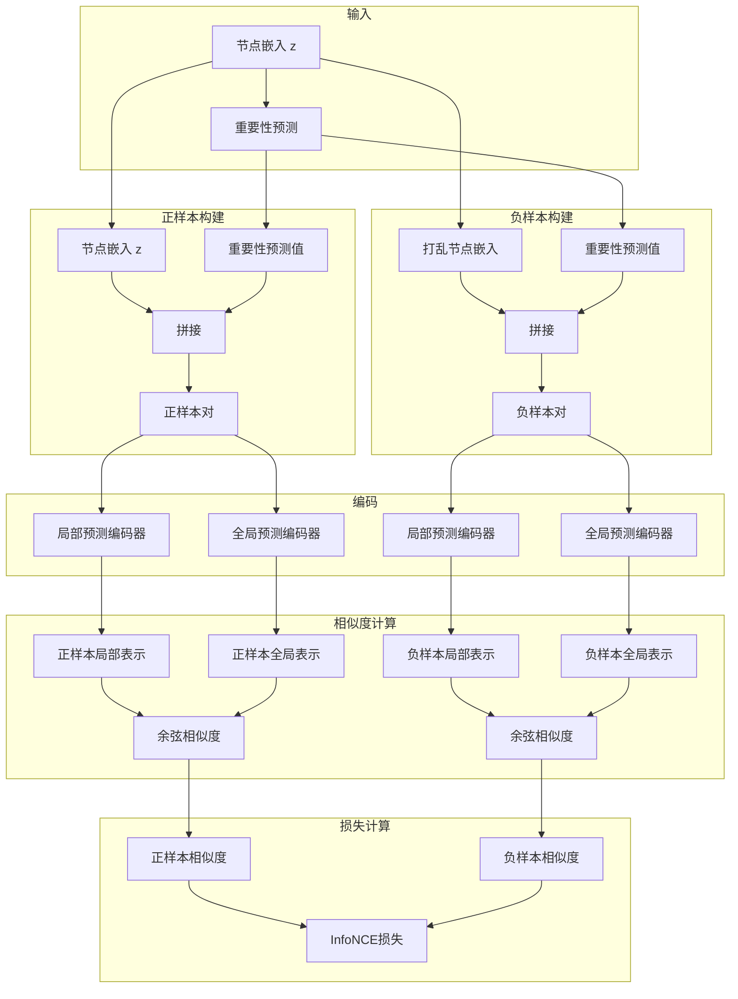

对比学习流程详解：

1. **输入准备**：
   - 从MPNN编码器获取节点嵌入z，维度为[N, output_dim]
   - 通过重要性预测器获取节点重要性预测值，维度为[N, 1]
   - 将重要性预测值扩展为与节点嵌入相同的维度[N, output_dim]

2. **正样本构建**：
   - 将节点嵌入与其对应的重要性预测值拼接，形成正样本对
   - 拼接后的维度为[N, output_dim*2]

3. **负样本构建**：
   - 随机打乱节点嵌入的顺序，创建负样本
   - 将打乱后的节点嵌入与原始重要性预测值拼接，形成负样本对
   - 拼接后的维度为[N, output_dim*2]

4. **编码处理**：
   - 使用局部预测编码器处理正样本对和负样本对，输出维度为[N, output_dim]
   - 使用全局预测编码器处理正样本对和负样本对，输出维度为[N, output_dim]

5. **相似度计算**：
   - 计算正样本的局部表示和全局表示之间的余弦相似度，结果为[N]
   - 计算负样本的局部表示和全局表示之间的余弦相似度，结果为[N]

6. **损失计算**：
   - 使用InfoNCE形式的对比损失函数
   - 目标是最大化正样本相似度，最小化负样本相似度
   - 将正负样本相似度组合成logits，维度为[N, 2]
   - 使用交叉熵损失计算最终的对比损失

### 训练与评估流程

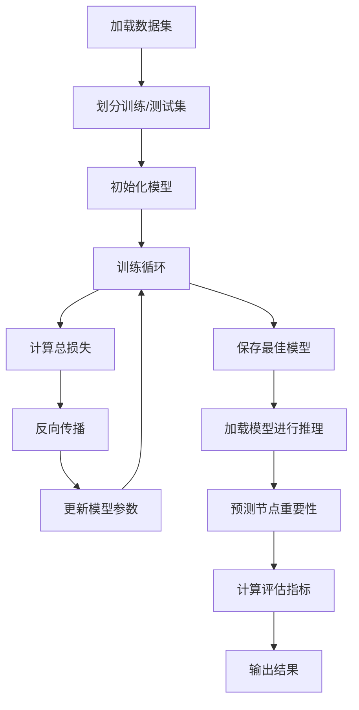

训练过程：
1. 加载动态图数据集，划分为训练集和测试集
2. 初始化NodeImportanceModel模型、优化器和学习率调度器
3. 训练循环：
   - 计算节点重要性预测
   - 计算排序损失和对比学习损失
   - 反向传播更新模型参数
4. 保存最佳模型（基于训练损失）
5. 加载模型进行推理，预测测试集中的节点重要性
6. 计算评估指标：Kendall's Tau相关系数和平均精度(MAP)
7. 输出结果

### 核心算法亮点

1. **结构化节点特征**：结合度特征、H-index特征和社区特征，全面捕捉节点在网络中的结构特性
2. **图注意力机制**：使用GAT层自适应地聚合邻居信息，关注重要连接
3. **对比学习优化**：通过对比学习辅助任务，提高节点表示的质量和区分能力
4. **成对排序损失**：使用成对排序损失函数，直接优化节点重要性的相对排序
5. **动态图处理能力**：能够处理随时间变化的动态图结构，预测不同时间步的节点重要性

## 核心文件详细分析

### data.py 分析

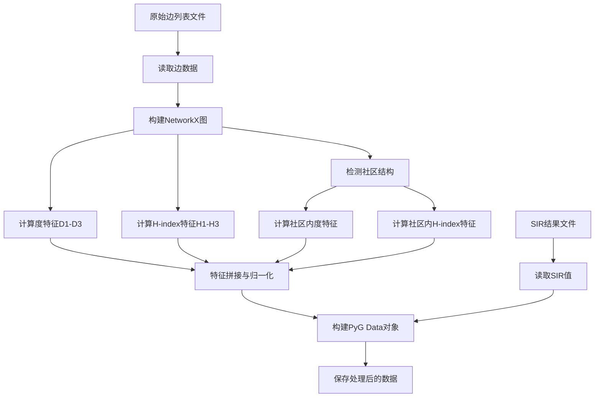

**数据处理流程**:
1. **特征计算**:
   - **度特征(D)**: 计算节点的度(D1)、节点及其邻居的度和(D2)、二阶邻居的度和(D3)
   - **H-index特征(H)**: 计算节点邻居的H-index(H1)、一阶邻居的H1和(H2)、二阶邻居的H2和(H3)
   - **社区特征**: 使用Louvain算法检测社区，计算社区内的度特征和H-index特征

2. **数据结构**:
   - 每个时间步的图表示为一个PyTorch Geometric的`Data`对象
   - 包含节点特征矩阵`x`、边索引`edge_index`、节点掩码`node_mask`和SIR值标签`y`

3. **数据划分**:
   - 按时间顺序划分训练集和测试集，使用`train_test_ratio`参数控制比例
   - 训练集用于模型训练，测试集用于评估模型预测性能

### model.py 分析

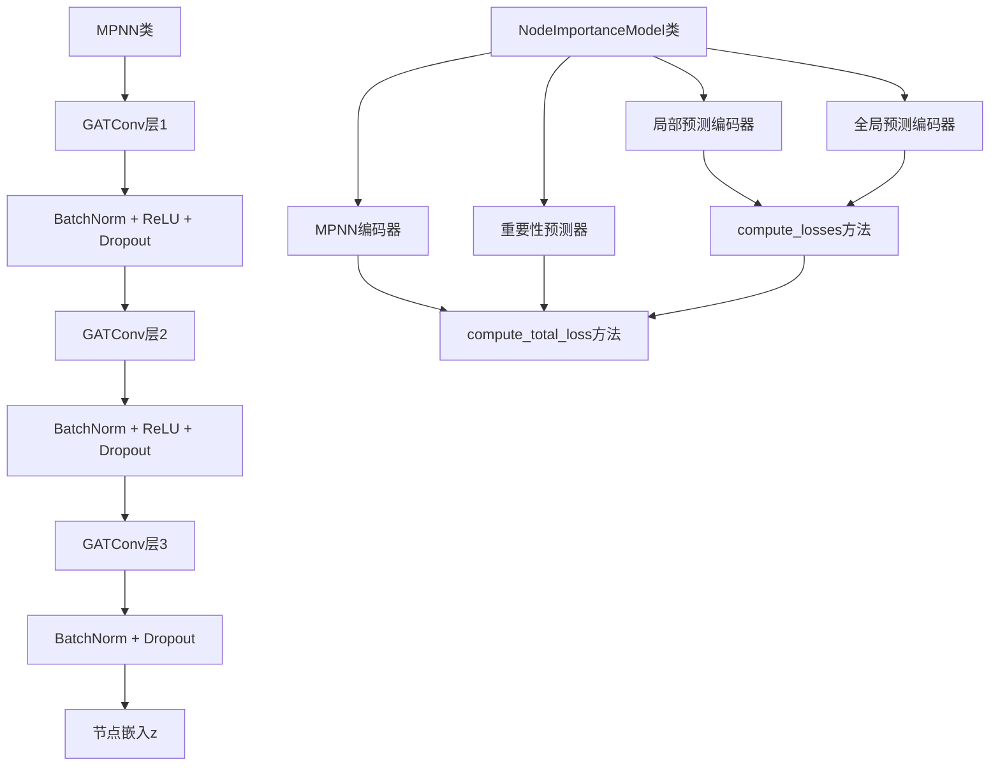

**模型结构分析**:
1. **MPNN类**:
   - 三层图注意力卷积(GATConv)，每层后接批量归一化、ReLU激活和Dropout
   - 第一层和第二层使用多头注意力(heads=2)，第三层使用单头注意力(heads=1)
   - 输出节点嵌入向量z

2. **NodeImportanceModel类**:
   - **编码器**: MPNN类，将图结构和节点特征编码为节点嵌入
   - **重要性预测器**: 两层全连接网络，将节点嵌入映射为重要性分数
   - **对比学习组件**: 局部和全局预测编码器，用于生成对比学习的表示

3. **损失函数**:
   - **排序损失**: 使用成对排序损失(pairwise_ranking_loss)，优化节点重要性的相对排序
   - **对比损失**: 通过正负样本对比，优化节点表示
   - **总损失**: 排序损失 + 对比损失

### SIR.py 分析

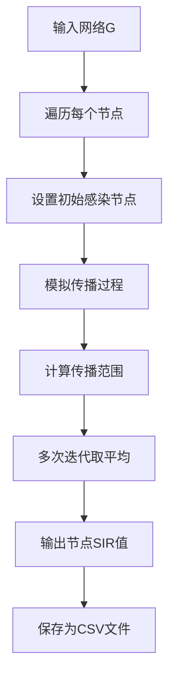

**SIR模拟流程**:
1. **传播模型**:
   - 使用经典SIR(Susceptible-Infected-Recovered)模型模拟疾病传播
   - 参数β控制传播概率，μ控制恢复概率

2. **计算方法**:
   - 对每个节点，将其设为初始感染节点
   - 模拟传播过程，计算最终被感染的节点数量
   - 多次迭代取平均，得到节点的传播影响力

3. **参数设置**:
   - 使用网络结构特性自适应计算传播概率β: β = a * (平均度/(度方差+平均度))
   - 参数a控制传播强度，通常在1.0-1.9之间

### eval.py 分析

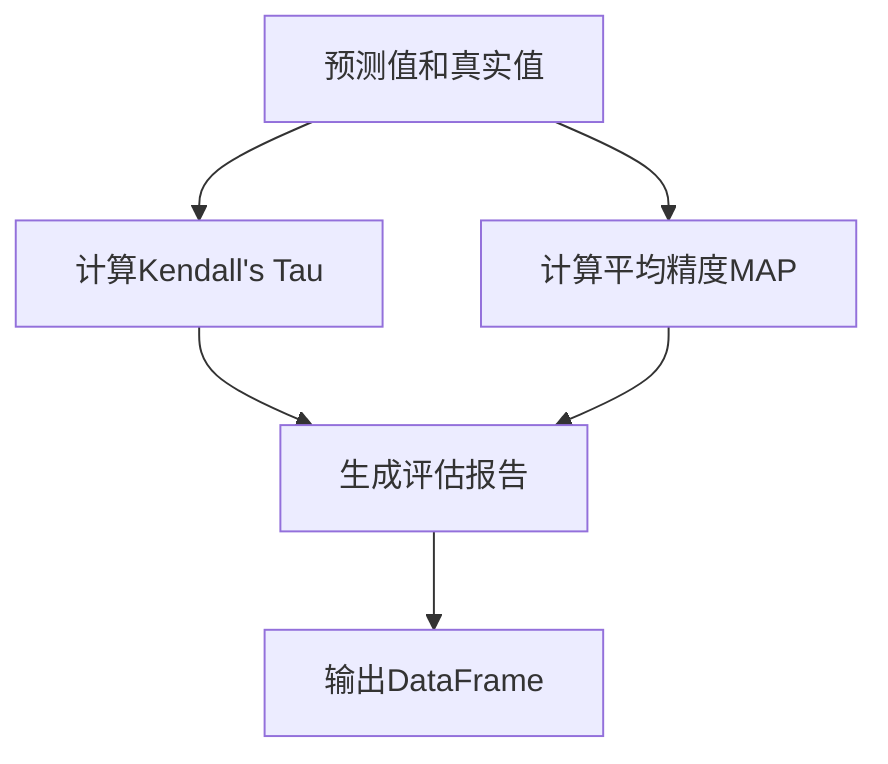

**评估指标**:
1. **Kendall's Tau相关系数**:
   - 衡量预测排序与真实排序的一致性
   - 值域[-1,1]，1表示完全一致，-1表示完全相反，0表示无相关性

2. **平均精度(MAP)**:
   - 将节点重要性转化为二分类问题，识别Top-k%重要节点
   - 评估模型识别重要节点的能力

### main.py 分析

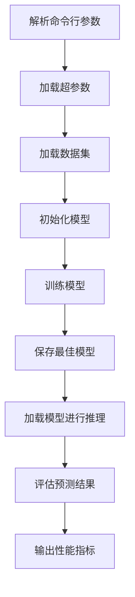

**主程序流程**:
1. **配置管理**:
   - 从config.ini加载超参数
   - 支持命令行参数指定数据集

2. **训练流程**:
   - 初始化模型、优化器和学习率调度器
   - 迭代训练，计算损失并更新模型参数
   - 保存训练损失最低的模型

3. **推理流程**:
   - 加载训练好的模型
   - 对测试时间步进行节点重要性预测
   - 计算评估指标并输出结果

## 特征提取详解

在模型处理之前，需要从原始图数据中提取结构化特征，这些特征对于节点重要性预测至关重要。

### 节点特征类型

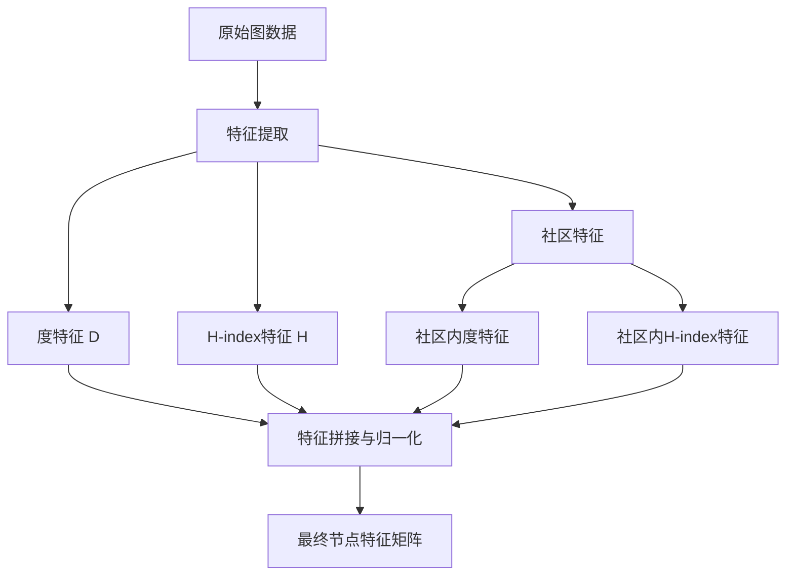

1. **度特征(D)**：
   - **D1**：节点的度，表示节点直接连接的邻居数量
   - **D2**：节点的度加上其所有邻居节点的度，捕捉一阶邻域信息
   - **D3**：节点的D2加上其所有邻居节点的D2，捕捉二阶邻域信息

2. **H-index特征(H)**：
   - **H1**：节点的h-index，表示节点邻居的度分布
   - **H2**：节点邻居的H1总和，捕捉一阶邻域的h-index信息
   - **H3**：节点二阶邻居的H1总和，捕捉二阶邻域的h-index信息

3. **社区特征**：
   - 使用Louvain算法检测社区结构
   - **社区内度特征**：在社区子图中计算D1、D2、D3
   - **社区内H-index特征**：在社区子图中计算H1、H2、H3

### 特征计算过程

1. **构建NetworkX图**：
   - 从边列表文件构建无向图
   - 获取所有节点的集合

2. **计算全局特征**：
   - 计算每个节点的度特征(D1, D2, D3)
   - 计算每个节点的H-index特征(H1, H2, H3)

3. **社区检测与特征计算**：
   - 使用Louvain算法检测社区
   - 为每个社区构建子图
   - 在子图中计算度特征和H-index特征

4. **特征归一化与拼接**：
   - 对所有特征进行Min-Max归一化
   - 将所有特征拼接成最终的节点特征矩阵

## 示例分析：具体数据流转

以一个具体的图为例，追踪数据在模型中的流转过程：

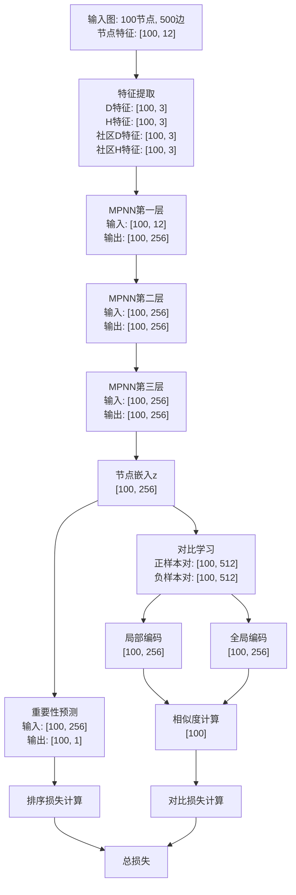

**数据流转说明**:
1. **特征提取**:
   - 从原始图中提取12维结构化特征（3维度特征 + 3维H-index特征 + 6维社区特征）
   - 所有特征经过归一化处理

2. **MPNN编码**:
   - 第一层: [100, 12] → [100, 256]，通过GATConv层处理节点特征
   - 第二层: [100, 256] → [100, 256]，进一步聚合邻居信息
   - 第三层: [100, 256] → [100, 256]，生成最终节点嵌入

3. **预测层**:
   - 将256维嵌入向量通过两层全连接网络映射为1维重要性分数
   - 输出: [100]，表示每个节点的重要性预测值

4. **对比学习**:
   - 将节点嵌入与重要性预测拼接，形成512维向量
   - 通过局部和全局编码器处理，生成256维表示
   - 计算正负样本对的相似度，形成对比损失

5. **损失计算**:
   - 排序损失: 使用成对排序损失优化节点重要性的相对排序
   - 对比损失: 使用InfoNCE损失优化节点表示
   - 总损失: 排序损失 + 对比损失

## 结论与展望

### 模型优势

1. **结构化特征提取**: 模型通过结合多种结构特征（度特征、H-index特征、社区特征），全面捕捉节点在网络中的位置和影响力，提高了节点重要性预测的准确性。

2. **图注意力机制**: 使用GAT层自适应地聚合邻居信息，能够区分不同邻居节点的重要性，更好地捕捉网络中的关键连接。

3. **对比学习增强**: 引入对比学习作为辅助任务，通过正负样本对比优化节点表示，提高了模型的泛化能力和表示学习质量。

4. **排序优化目标**: 使用成对排序损失直接优化节点重要性的相对排序，更符合节点重要性预测的实际应用需求。

5. **动态图处理能力**: 能够处理随时间变化的动态图结构，预测不同时间步的节点重要性，适用于真实世界中的动态网络分析。

### 应用场景

1. **疾病传播预测**: 识别社交网络中的超级传播者，辅助疫情防控
2. **舆情监控**: 发现信息网络中的关键节点，预测信息传播路径
3. **网络安全**: 识别网络中的关键节点，优化防护资源分配
4. **社交网络分析**: 发现社交网络中的意见领袖和关键用户
5. **生物信息学**: 分析蛋白质交互网络中的关键蛋白质

### 未来改进方向

1. **时序信息融合**: 进一步整合历史时间步的信息，提高对未来节点重要性的预测能力
2. **异构图扩展**: 扩展模型以处理具有多种节点和边类型的异构图
3. **可解释性增强**: 提高模型预测结果的可解释性，解释为什么某些节点被预测为重要节点
4. **计算效率优化**: 优化大规模图处理的计算效率，使模型能够应用于更大规模的网络
5. **自适应参数调整**: 根据不同网络的特性自适应调整模型参数，提高模型的适应性
